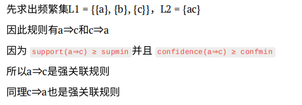
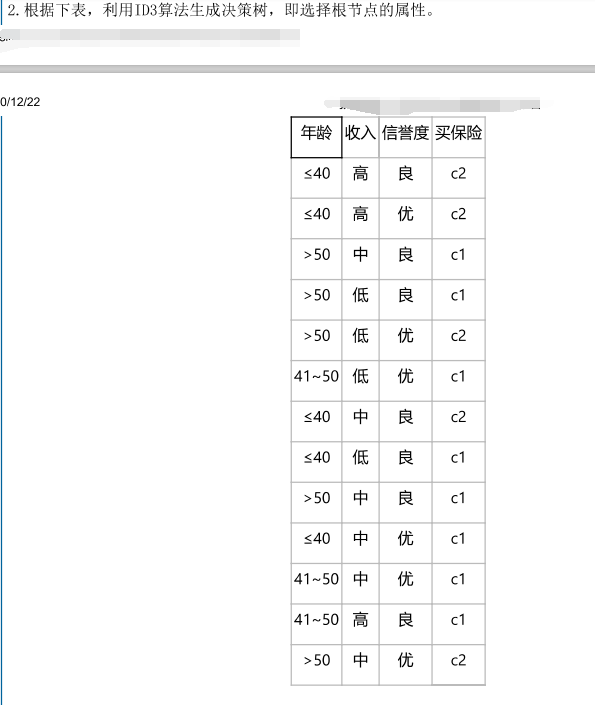
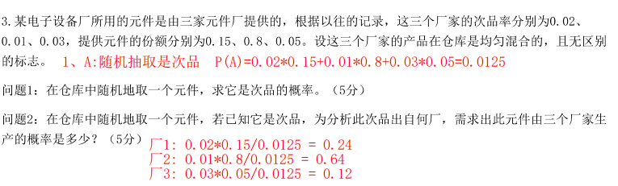
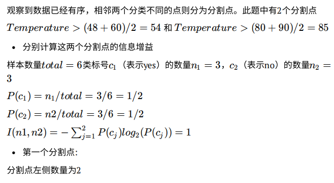
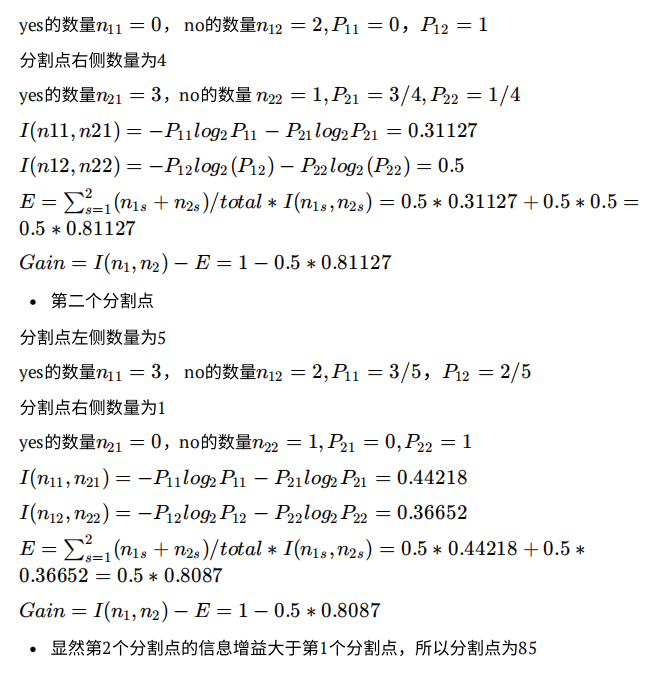
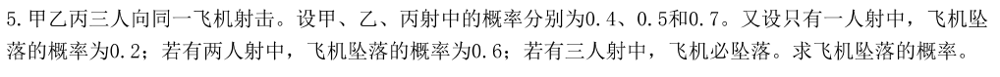

填空题：

1、数据仓库就是一个 <u>面向主题的</u>、 集成的、 <u>相对稳定的</u>、反映历史变化的数据集合

2、元数据是描述数据仓库内数据的结构和建立方法的数据，根据元数据用途不同可将数据仓库的元数据分为 <u>技术元数据</u> 和 <u>业务元数据</u>

3、数据的处理通常分为两大类：联机事务处理和 <u>联机事务分析</u>

4、多维分析是指对以“维”形式组织起来的数据采取<u>切片</u>、切块、<u>钻取</u>、和旋转等各种分析动作。

5、ROLAP是基于关系数据库的OLAP实现的，而MOLAP是基于多维数据结构的OLAP实现的。

6、数据仓库按照其开发过程，其关键环节包括<u>数据抽取</u>，<u>数据存储与管理</u>和数据表现

7、操作型数据存储时间上是一个集成的、面向主题的、<u>可更新的</u>、<u>当前值的</u>、数据库。

8、从应用的角度来看，数据仓库的发展演变可以归纳为5个阶段：<u>以报表为主</u>、<u>以预测模型为主</u>、<u>以运营导向为主</u>和以实时数据仓库和自动决策为主

9、“实时数据仓库”意味着源数据系统、决策支持服务和数据仓库之间以一个<u>接近实时的</u>速度交换数据和业务规则。

10、调和数据是存储在<u>企业级数据仓库</u>和操作型数据存储中的数据

11、数据抽取的两个常见类型是静态抽取和增量抽取，静态抽取用于<u>最初填充</u>，增量抽取用于进行数据仓库的维护

12、粒度是对数据仓库中数据的综合程度高低的一个衡量，粒度越小，细节程度<u>越高</u>，综合程度<u>越低</u>、回答查询的种类<u>越多</u>

13、使用星型模式可以从一定的程度上<u>提高</u>查询效率，因为星型模式中数据的组织形式已经经过<u>预处理</u>，主要数据存储在庞大的<u>事务表</u>中。

14、维度表一般由主键、分类层次和描述属性组成，对于主键可以选择两种方式，一种是采用<u>自然键</u>，另一种是<u>代理键</u>。

15、雪花型模式是对<u>星型模式</u>维表的进一步层次优化和规范化来消除冗余数据

16、数据仓库中存在不同综合级别的数据，一般把数据分为4个级别：<u>早期细节级</u>，当前细节级，<u>轻度综合级</u>和高度综合级

17、数据仓库的概念通常采用信息包图法来进行设计，要求将其中的5个组成部分名称、<u>维度</u>、<u>类别</u>、层次和<u>度量</u>全面描述出来。

18、数据仓库的<u>逻辑模型</u>通常采用星型图法来进行设计，要求将星型图的各类逻辑实体完整地描述出来。

19、按照事务表中度量的可加性情况，可以把事务表对应的事实分为4中类型：<u>事务事实</u>，<u>快照事实</u>、<u>线性项目事实</u>和事件事实。

20、确定了数据仓库的粒度模型后，为了提高数据仓库的使用性能，还需要根据用户需求设计<u>聚合</u>。

21、当维表中的主键在事务表中没有与外键关联时，这样的维称为<u>退化维</u>。

22、维度可根据其变化的快慢分为：<u>无变化维度</u>、<u>缓慢变化维度</u>和<u>剧烈变化维度</u>三类

23、数据仓库的数据量通常较大，且数据一般很少更新，可以通过设计和优化<u>索引</u>结构来提高数据存取性能

24、数据仓库数据库常见的存储优化方法包括表的归并与簇文件、<u>反向规范化</u>、<u>引入冗余</u>表的物理分割。

25、关联规则的经典算法包括<u>Apriori</u>和<u>FP-growth</u>，其中<u>FP-growth</u>的效率更高

26、分类的过程包括：<u>获取数据</u>、<u>预处理</u>、<u>分类器设计</u>和<u>分类决策</u>。

27、分类器设计阶段包含三个过程：<u>获取数据集</u>、<u>分类器构造</u>、<u>分类器测试</u>

28、分类问题中常用的评价准则有<u>精确度</u>、<u>查全率和查准率</u>、<u>F-meansure</u>和<u>几何均值</u>。

29、支持向量机中常用的核函数有：<u>多项式核函数</u>、<u>径向基核函数</u>和<u>S型核函数</u>。

30、聚类分析包括：<u>连续性</u>、<u>二值离散型</u>、<u>多值离散型</u>和<u>混合类型</u>四种类型描述属性的相似度计算方法。

31、连续性属性的数据样本之间的距离有<u>欧氏距离</u>、<u>曼哈顿距离</u>和<u>明考斯基距离</u>

32、层次聚类的方法包括：<u>凝聚型</u>和<u>分解型</u>两种层次聚类方法

简答题：

1、什么是数据仓库的数据ETL过程？
			负责将操作型数据转换成调和数据的过程

2、贝叶斯网络的三个主要议题是什么？
			a、贝叶斯网络预测   b、贝叶斯网络诊断   c、贝叶斯网络学习

3、什么是聚类分析？聚类分析的应用领域有哪些？
			将物理或抽象的数据集合划分为多个类别的过程。科学数据分析、商业、生物学、文本挖掘。

4、怎样从历史数据中训练出结点之间的条件概率或联合概率？
			训练条件概率P(B|A)，历史数据中统计A发生的次数T(A)，然后统计A发生数据中B发生的次数T(A,B)，P(B|A) = T(B)/T(A)。
			训练联合条件概率P(C|A,B)，历史数据中统计A、B共同发生的次数T(A,B)，然后统计在A、B发生数据中C发生次数T(A,B,C)，P(A,B,C)/T(A,B)。

5、简单遗传算法包括哪些步骤？
			1、初始化种群
			2、计算个体适应度
			3、按选择概率执行选择算子
			4、按交叉概率执行交叉算子
			5、按变异概率执行变异算子
			6、满足终止条件输出满意解，否则执行第二步。

6、前馈网络和递归网络有什么本质区别？
			前馈网络的所有输出不能作为输入。
			递归网络的某些输出可以作为输入。

7、请比较PCA和LDA的区别
			PCA是无监督的，LDA是有监督的。

8、简述Apriori算法思想
			多次扫描交易记录集，产生不同长度的频繁集。

9、分析特征提取和特征选择的区别
			特征提取的结果是原来特征的一个映射。
			特征选择的结果是原来特征的一个子集。

10、TF-IDF算法及实际意义
			信息检索与数据挖掘的常用加权技术；词频-逆文本频率指数。用于挖掘文章中的关键词。

11、数据挖掘与统计的的区别和联系
			区别：统计学侧重假设驱动，数据挖掘侧重数据驱动。
			联系：数据挖掘是统计学、计算机科学、人工智能等构成的学科。

12、聚类和分类的区别和联系
			区别：分类属于监督学习，聚类属于无监督学习
			联系：都是给样本数据划分类别

13、分类及应用领域
			把样本映射到事先定义的类中的学习过程。商业、生物学、文本挖掘。

14、什么是信息包图法？它为何适用于数据仓库的概念模型的设计
			也叫用户需求表，在一张平面表格上描述元素的多维性。采用自上而下的建模方法，考虑了几乎所有的信息源以及信息源影响业务活动的方式。

15、关联规则的分类有哪些？关联规则挖掘的步骤包括什么？
			单维和多维、单层和多层、布尔型和数值型。1)、找出大于等于最小支持度的频繁项集，2)、利用频繁项集生成关联规则。

16、什么是关联规则？关联规则的应用有哪些？
			发现用户购买的商品之间的隐含的关联关系，并用规则表示。文本挖掘、广告推荐、银行客户需求。

计算题：

1、
解：

2、

解：详细解答请联系作者。

3、

4、
解：

5、
解：一人射中：甲中乙丙未中            乙中甲丙未中             丙中甲乙未中      						0.4X0.5X0.3    +    0.5X0.6X0.3        +      0.7X0.6X0.5 = 0.36
       两人射中：甲乙中丙未中             甲丙中乙未中             乙丙中甲未中 						0.4X0.5X*0.3    +        0.4*X.7X0.5         +        0.5X0.7X0.6 = 0.41
        三人射中：  0.4X0.5X0.7 = 0.14

飞机坠落：0.36X 0.2+0.41X 0.6+1*0.14 = 0.458

论述题：

1、请列出3种数据仓库产品，并说明其优缺点。
			1、SAS，功能强、性能高，特点突出；系统比较复杂。
			2、Essbase，前端工具多，支持多种财务标准；开发难度大，部署不容易。
			3、Powerplay，简洁部署，交互性强，有独立客户端。相对封闭。

2、什么是信息包图法，它为什么适用于数据仓库的概念模型设计。
			信息包图法也叫用户需求表，就是在一张平面表格上描述元素的多维行。信息包图法采用自上而下的数据建模方法，这种方法几乎考虑了所有的信息源以及这些信息源影响业务活动的方式。

3、谈一谈你对数据挖掘未来发展趋势的看法
			未来将会偏向多模态数据挖掘；目前大部分的数据挖掘是针对结构化数据进行挖掘，但是大数据时代，非结构化数据占主流。所以未来数据挖掘必然朝着大数据非结构化数据方面发展。

4、请列举3中种数据挖掘过程中学过的分类方法，并说明其优缺点。
			1、ID 3，假设空间包含所有的决策树，搜索完整空间。不受噪声影响。没有考虑连续特征，对缺失值没有进行考虑。
			2、KNN，精度高、对异常值不敏感。时间、空间复杂度高。
			3、SVM，使用核函数向高维空间进行映射，解决非线性分类。对确实数据敏感，对大规模训练样本难以实施。

5、列举几项你知道的数据挖掘应用，并论述数据挖掘在其中的作用。
			1、分类，根据特征判断对象属于哪个学习类别；识别信用卡交易属于合法还是非法；电信客户流失分析。
			2、聚类，归类对象使得同组对象尽可能相似；归并文档、市场分割。
			3、关联分析，给定一组记录，分析项目之间的依赖关系。购物分析。

6、简述你对数据仓库未来发展趋势的看法。
			数据仓库技术的发展包括数据抽取、存储管理、数据表现等方面。数据抽取未来的发展将集中在系统集成方面，使得系统更加便于管理和维护。数据库厂商会明确推出数据仓库引擎，作为数据仓库服务器产品和数据库服务器并驾齐驱；这便是数据存储的未来发展趋势。在未来发展中，数据表现与Internet/web技术更加紧密结合，数理统计的算法和功能将普遍集成到联机分析产品中。数据仓库实现过程的的方法论将更加普及，将成为数据库设计的一个明确分支，成为管理信息系统设计的必备。